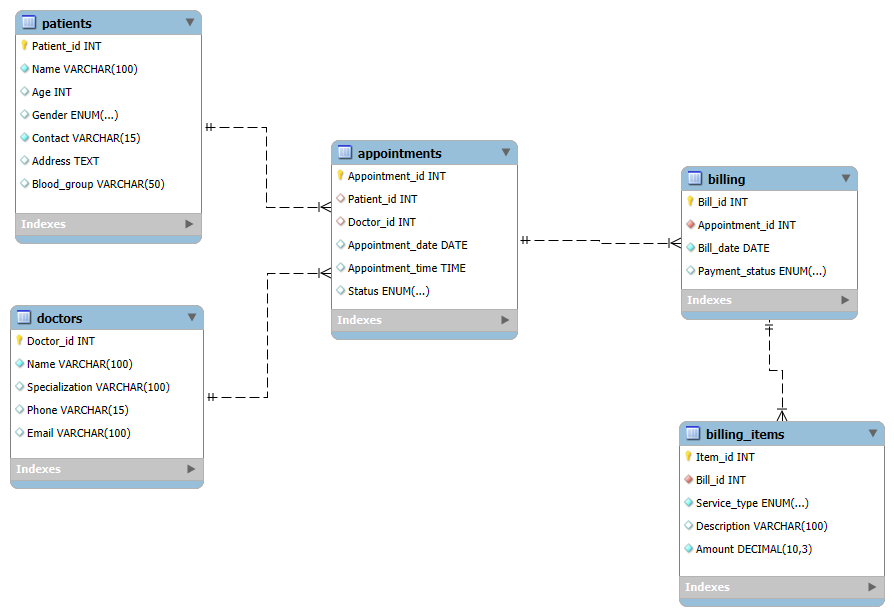

# 🏥 Hospital Management System (SQL Project)

## 📌 Overview
This project is a **Hospital Management Database** built using **MySQL**.  
It manages patients, doctors, appointments, billing, and billing items (consultation, medicines, lab tests).  

## 📂 Database Schema
- **Patients Table** → stores patient details.  
- **Doctors Table** → stores doctor details and specialization.  
- **Appointments Table** → links patients with doctors.  
- **Billing Table** → stores bills per appointment.  
- **Billing_Items Table** → itemized details (consultation, medicines, lab tests).  

## 📊 Sample Queries
- View all appointments with patient and doctor names.  
- Generate detailed bill reports per patient.  
- Show unpaid bills and total revenue per doctor.  

## 📸 EER Diagram

